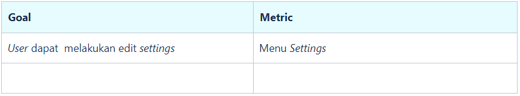
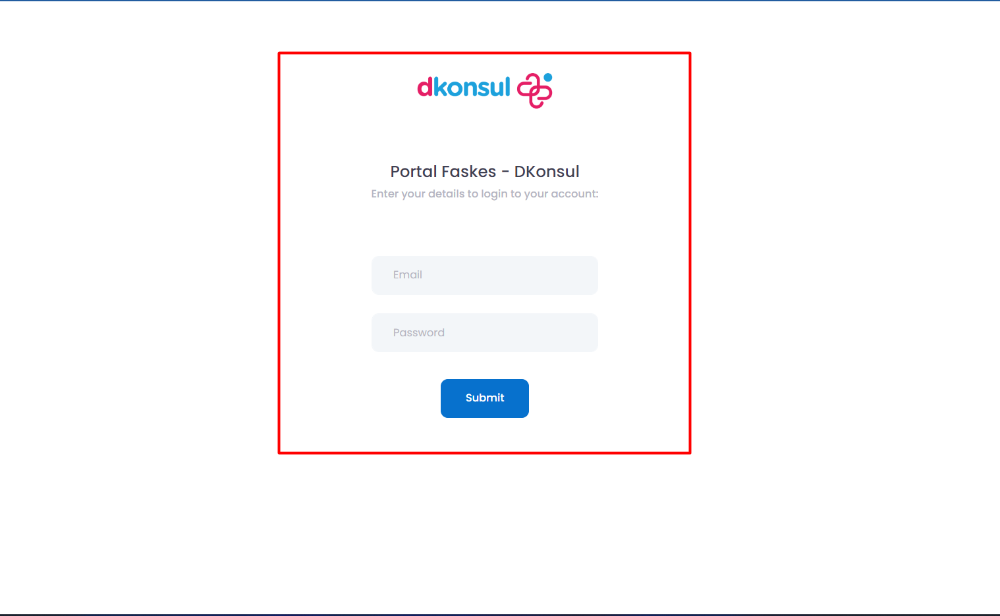
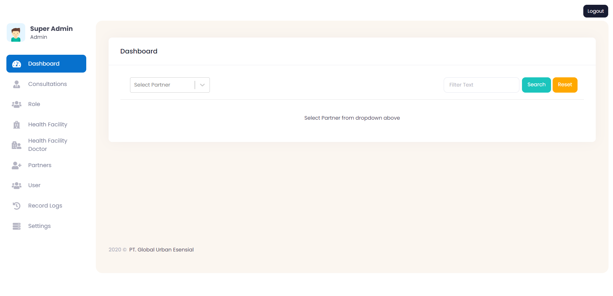
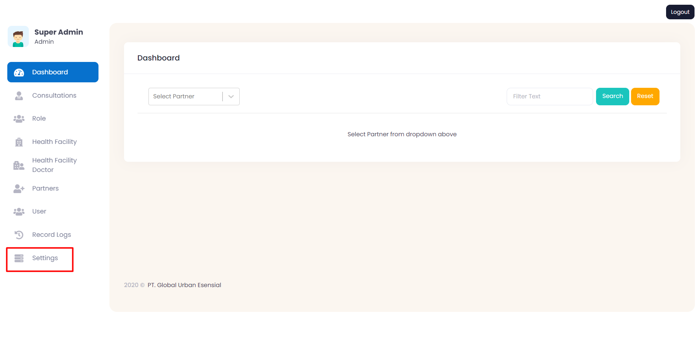
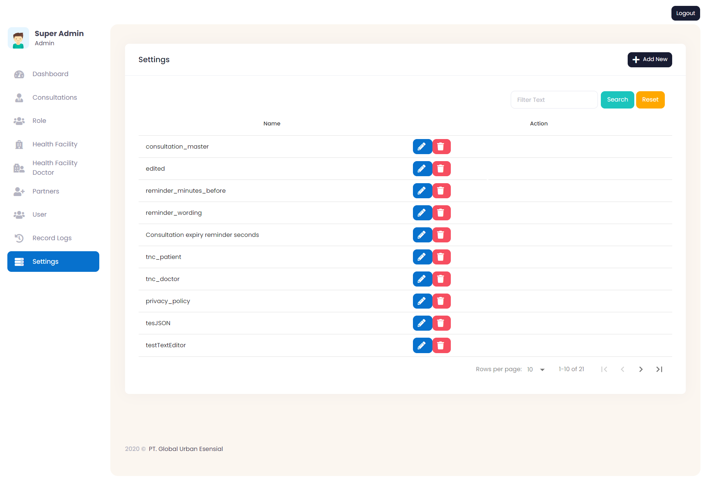

## Overview
- _*User*_ dapat melihat _*Settings*_ DKonsul secara menyuluruh.

## Succes Metrics

## Flow DKonsul App
| Requirement      | User Story| Gambar         |
|------------------|-----------|----------------|
| User melakukan login ke [Dkonsul](https://staging-faskesportal.d2d.co.id/)     | Sebelum dapat mengakses fitur Settings, user diharuskan terlebih dahulu untuk masuk (log in) ke aplikasi Dkonsul menggunakan akun user yang telah dibuat Berikut ini langkah-langkah untuk log in ke aplikasi Dkonsul, untuk masuk ke aplikasi Dkonsul, silakan menuju ke halaman Loading - DKonsul   terlebih dahulu. Tampilan dari halaman login tersebut akan terlihat seperti gambar disamping.Kemudian, isikan email dan password akun Anda, lalu tekan tombol “Submit”. Anda dapat menggunakan akun yang sudah didaftarkan.   |      |
|  User dapat melihat dashboard aplikasi DKonsul      | Jika proses login berhasil, Anda akan diarahkan ke halaman dashboard pengguna. Tampilan dari halaman dashboard pengguna tersebut akan terlihat seperti pada gambar disamping   |   |
| User dapat melihat dashboard halaman Settings DKonsul   | Setelah user berhasil log in ke aplikasi Dkonsul dan sampai ke halaman dashboard, Anda dapat mengarahkan kursor Anda ke sebelah kiri halaman dan terlihat beberapa menu di sidebar, Selanjutnya, kilk button Setting DKonsul di sidebar menu, maka user akan diarahkan ke halaman settings DKonsul yang tampilannya terlihat seperti pada gambar disamping   |       |
| User dapat menambahkan settings enviroment baru di DKonsul      | User dapat menambahkan settings dengan mengklik tombol “add new” , maka user akan diarahkan ke halaman “add settings”. Isi data seperti nama settings , tipe settings, dan value settings.   | `Los Angeles` |

## Settings Enviroment
- Berikut adalah penjelasan dari settings enviroment DKonsul

| Name Settings      | Description| Type       |Value       |
|--------------------|------------|------------|------------|
| `consultation_master`   | `DailyWeeklyList` : Konsumsi obat pasien mingguan/harian `MedicineConsumptionTimeList` : Konsumsi obat pasien sebelum/sesudah/bersama makan atau tidak perlu bersama makan    | **JSON**     | |
| `edited`   |     | **TEXT_EDITOR**     | 3 |
| `reminder_minutes_before`   | Mengatur setting reminder ke dokter untuk konsultasi dan reminder tersebut akan muncul sebelum jadwal konsultasi berlangsung   | **TEXT**     | 15(_Minutes_) |
| `reminder_wording`   | Mengatur setting reminder ke dokter untuk konsultasi dan reminder tersebut akan muncul sebelum jadwal konsultasi berlangsung     | **TEXT**     |  Praktek dokter akan dimulai 15 menit lagi  |
| `Consultation expiry reminder seconds`   |Action dari reminder untuk dokter saat konsultasi sedang berlangsung yang akan memunculkan notifikasi reminder saat sisa waktu 5 menit terakhir      | **TEXT**     | 300(_Second_) |
| `tnc_patient`   |	Action akan muncul saat pasien melakukan konsultasi  | **TEXT_EDITOR**     | [TNC For Patien](https://docs.google.com/document/d/1sCwckdVRZ8ibhzUFkduvkaeYOH7Z4R608RO6z6O8hr0/edit?usp=share_link) |
| `tnc_doctor`   |Action akan muncul saat dokter melakukan konsultasi   | **TEXT_EDITOR**     | [TNC For Doctor](https://docs.google.com/document/d/11XVsrS9IPwC5cWtyvB7IqFSIE6ZCM77ydChjdSb-5n8/edit?usp=share_link) |
| `privacy_policy` |Action untuk merubah Privacy Policy di aplikasi DKonsul  | **TEXT_EDITOR** |**Privacy Policy** Hello Please read this before you go to next step:with accept this form you are accept bla bla bla |
| `tesJSON`   |     | **JSON**     | `{'key':'value'}` |
| `testTextEditor`   |     | **TEXT_EDITOR**     | apa yang terjadi |
| `informed_consent`   |Berisi informasi dan persetujuan yang harus dibaca oleh pasien     | **TEXT_EDITOR**     | [Informed Consent](https://docs.google.com/document/d/1SJgA1veZAjtEv2cvqmlODuKEzv6JAQq2tFTmHa5KXKU/edit?usp=sharing) |
| `wa_number_prescription`   | Action untuk mengirimkan nomor kontak WhatsApp ketika pasien telah selesai melakukan konsultasi dan dikirimkan ke E-mail pasien     | **TEXT**     | 6282125000512 |
| `prescription_time_limit`   |	Action yang akan dikirimkan saat dokter menulis resep untuk pasien selama waktu yang telah ditentukan yaitu 14 menit, kemudian jika waktu sudah lebih dari 14 menit maka dokter tidak bisa mengubah lagi resep yang telah ditulis     | **TEXT**     | 14 (_minutes_) |
| `min_consultation_time_limit`   |Minimum dari pasien untuk mengakhiri konsultasi ke dokter selama beberapa menit    | **TEXT**     | 1 |
| `latency_time_finding_doctor`   |	Action delay untuk mencari dokter selama beberapa menit, jika sudah melebih waktu tersebut maka akan lanjut mencari dokter lagi selama beberapa menit     | **TEXT**  | 5 |
| `warn_consultation_time_remaining`   |Action sisa waktu 3 menit terakhir maka durasi konsultasi berubah warna menjadi merah     | **TEXT**     | 3 |
| `idle_time_in_minute`   |Pasien akan masuk ke halaman coba lagi, waktu yang diberikan ke pasien selama 45 menit untuk mencari dokter. Jika lebih dari 45 menit maka pasien bisa membuat order baru lagi      | **TEXT**     | 45(_minutes_) |
| `technical_cs`   |Pasien akan dikirimkan nomor WhatsApp ke email jika membutuhkan bantuan teknis     | **TEXT** |62898988818181  |
| `api_doc_consultation_url`   |Link api document yang dikirimkan ke email jika membutuhkan bantuan teknis     | **TEXT**     | [API DOC](https://developer.dkonsul.com/) |
| `quick_chat`   |Berisikan Template Type Message     | **JSON**     |  |
