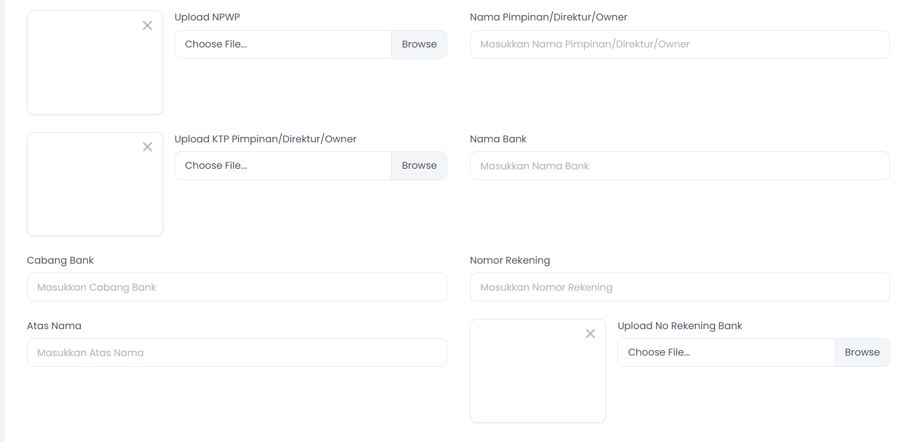

## Pendaftaran Assist

Pertama-tama kita mendaftar di assist dengan mengklik link berikut : [Assist](https://dev-essensial.assist.id/baru)

Field yang bisa di edit adalah : 
1. Field “Saya adalah?” didalam field ini terdapat fitur dropdown list yang berisi : 
    - Pemilik Faskes
    - Management Faskes
    - IT Faskes

    

Field ini menjelaskan bahwa anda adalah Pemilik Faskes atau Management Faskes atau juga sebagai IT Faskes, anda dapat memilih dengan
mengklik dropdown fitur yang tersedia di form tersebut.

2. Field Jenis Kelamin , anda juga bisa memilih jenis kelamin dengan mengklik dropdown menu tersebut.

    

3. Field Nama Lengkap, No. HP, Email, Username, Password, Re-type Password, Kode Sales dan Pilih Produk

     

untuk field ini terdiri dari : 

| Daftar Field      | Deskripsi|
|------------------|-----------|
| **Nama Lengkap**   |Calon Faskes harus menyertakan nama lengkap untuk kebutuhan administrasi.    |
| **No. HP**   |Nomor Handphone Calon Faskes harus nomor yang aktif agar mudah dihubungi.    |
| **Email**   |	Email Calon Faskes juga harus email yang aktif.    |
| **Password**   |Calon Faskes juga bebas menetukan password mereka, yang mudah dihafal dan tentunya harus lebih aman.    |
| **Re-type Password**   |	Field ini digunakan untuk menulis ulang password yang sudah ditentukan oleh Calon Faskes.    |
| **Kode Sales**   |Field ini digunakan untuk menulis kode sales, Calon Faskes memasukkan kode sales sesuai dengan kode sales yang dimiliki oleh sales assist.    |
|Pilih Produk|Calon Faskes dapat memilih produk mana yang disukai oleh calon faskes, biasanya produk sudah ditentukan dari awal oleh sales, jadi saat pemilihan produk calon faskes hanya mengklik sesuai produk pilihannya.|
|**Verification Captcha**|Fitur yang memberikan lapisan keamanan pada website untuk memastikan bahwa website diakses oleh manusia sungguhan, bukan robot. Contoh captcha yaitu ketika Anda membuka suatu website, Anda diminta untuk mengisi rangkaian huruf, gambar, atau puzzle gambar lebih dulu.|

## Pendaftaran DKonsul

Pertama-tama kita melakukan [Login](https://staging-faskesportal.d2d.co.id/)  kemudian anda bisa mengklik menu “Health Facility Doctor”

kemudian anda bisa klik button +Add New seperti pada gambar berikut.

Kemudian kita bisa isikan form yang harus diisi sesuai dengan data Calon Faskes, seperti pada form berikut ini : 

| Daftar Field      | Deskripsi|
|------------------|-----------|
| **Nama Lengkap Klinik/RS**|Calon Faskes harus menamai klinik/RS mereka|
| ***Nama Grup Klinik/RS**|Calon Faskes harus menamai grup klinik/RS mereka|
| **Email Klinik**|Email Calon Faskes haruslah aktif karena digunakan untuk kebutuhan administrasi|
| **Logo Klinik**|Calon Faskes harus mempunyai logo klinik agar mudah dikenali|
| **Time Zone**|Sudah di settings automatis oleh sistem|
| **Days**|Calon Faskes bisa memilih hari buka klinik/rs|
| **Opening Hours**|Calon Faskes bisa memilih jam buka klinik/rs|
| **Closing Hours**|Calon Faskes bisa memilih jam tutup klinik/rs|
| **Dokter Penanggung Jawab (DPJ) Nama Lengkap**|Calon Faskes harus memilih DPJ sesuai dengan kriteria yang sudah kompeten|
| **No HP**|DPJ harus memiliki nomor telepon yang aktif|
| **Email**|DPJ harus memiliki email yang aktif untuk kebutuhan administrasi|
| **Status**|Calon Faskes dapat memilih Status DPJ tersebut.|
| **No STR (Surat Tanda Registrasi)**|Calon Faskes harus memiliki STR|
| **Tanda Registrasi Dokter Penanggung Jawab Faskes (PIC)**|DPJ Calon Faskes harus mempunyai STR|
| **No SIP (Surat Izin Praktek) DPJ**|DPJ Calon Faskes harus memiliki nomor SIP|
| **Upload SIP**|DPJ Calon Faskes harus mengupload dokumen SIP|
| **Class**|DPJ Calon Faskes juga bisa memilihi Class sesuai kebutuhan|
| **Nama** PIC Admin ( Yang Menerima Order) |DPJ Calon Faskes harus mempunyai STR|
| **No HP**|Nomor hp Admin haruslah yang nomor aktif|
| **Email**|Email admin harus yang aktif untuk kebutuhan administrasi|
| **Nama Perusahaan** Identitas Badan Usaha/Badan Hukum Lainnya |Nama perusahaan dari calon faskes haruslah nama yang terdaftar di Negara Indonesia|
| **Bentuk Badan Hukum**|Badan Hukum sesuai bentuk yang terdaftar|
| **Fasilitas KesehataA**|Fasilitas kesehatan juga bisa dipilih sesuai Faskes yang terdaftar|
| **No Akta**|Badan Hukum Calon Faskes haruslah terdaftar dan mempunya nomor akta|
| **Upload Akta**|Fasilitas kesehatan juga bisa dipilih sesuai Faskes yang terdaftar|
| **Nomor Izin Usaha/Izin Lainnya (SIUP/TDP/NIB)**|Jika Badan Hukum Calon Faskes mempunyai izin lainnya bisa di cantumkan|
| **Tanggal Expired (SIUP/TDP/NIB)**|Jika Surat izin tersebut mempunyai expired/tanggal habis yang perlu diperharaui, bisa di cantumkan|
| **Upload SIUP/TDP/NIB**|Jika mempunyai dokumen tersebut bisa di upload|
| **Status PKP (Pengukuhan Pengusaha Kena Pajak)**|Pengusaha atau Wajib Pajak Badan, tidak termasuk di dalamnya untuk pengusaha skala kecil, yang melakukan penyerahan Barang Kena Pajak (BKP) dan/atau Jasa Kena Pajak (JKP)|
| **Upload SP-PKP**|Dokumen bisa di upload|
| **No SIK/SIO**|Bukti tertulis pemberian kewenangan untuk menjalankan pekerjaan keperawatan di seluruh wilayah Indonesia. Surat Izin Kerja selanjutnya disebut SIK adalah bukti tertulis yang diberikan kepada perawat untuk melakukan praktik keperawatan di sarana pelayanan kesehatan|
| **Tanggal Expired SIK/SIO**|Jika surat izin mempunyai expired/tanggal habis yang perlu diperbaharaui bisa di cantumkan
| **Upload SIK/SIO**|Dokumen bisa di upload|
| **Nomor SIPA**|Calon Faskes harus mempunyai apoteker, dan apoteker tersebut harus mempunyai nomor SIPA|
| **Nama Apoteker (dalam SIPA)**|Nama Apoteker tersebut harus sesuai dengan SIPA|
| **Tanggal Expired SIPA**|Tanggal Expired harap dicantumkan|
| **Upload Scan SIPA**|Dokumen bisa di upload|
| **Nomor NPWP**|Nomor yang diberikan kepada wajib pajak sebagai sarana dalam administrasi perpajakan yang dipergunakan sebagai tanda pengenal diri atau identitas wajib pajak dalam melaksanakan hak dan kewajiban perpajakannya|
| **Upload NPWP**|Fasilitas kesehatan juga bisa dipilih sesuai Faskes yang terdaftar|
| **Nama Pimpinan/Direktur/Owner**|Nama Pimpinan/Direktur/Owner harus sesuai dan terdaftar di Negara Indonesia|
| **Upload KTP Pimpinan/Direktur/Owner**|Dokumen KTP bisa di upload|
| **Nama Bank**|Bank bisa memilih salah satu bank yang ada di Indonesia|
| **Cabang Bank**|Cabang Bank bisa disesuaikan dengan Calon Faskes mendaftar di daerah  tersebut|
| **Nomor Rekening**|Nomor rekening sesuai dengan Bank yang didaftarkan|
| **Atas Nama**|Sesuai dengan Atas Nama yang didaftarkan|
| **Upload Rekening Bank**|Dokumen bisa di upload|
| Location Section|Location section ini digunakan untuk menaruh pin point atau lokasi akurat dari Faskes/Klinik/RS tersebut|
| Location|Sesuai dengan location section yang di pilih|
| Alamat Lengkap Klinik|Sesuai alamat klinik masing-masing|
| Deskripsi|Bisa mendiskripsikan, sesuai kebutuhan masing-masing|
| Status (Enabled/Disable)|Status bisa di pilih Enabled atau tidak menggunakan Radio Button|

## Mapping Pendaftaran DKonsul dan Assist

| Assist     | DKonsul|
|------------------|-----------|
| Nama Lengkap|	Nama Lengkap (Dokter Penanggung Jawab (DPJ))|
| No HP|No HP|
| Email|Email|