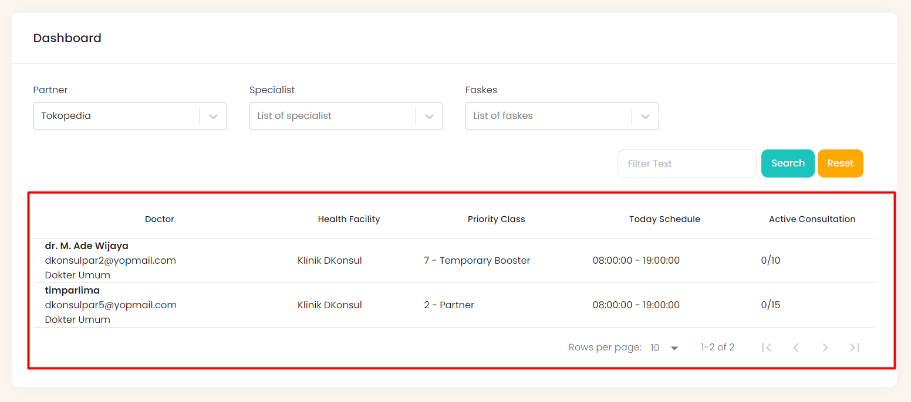
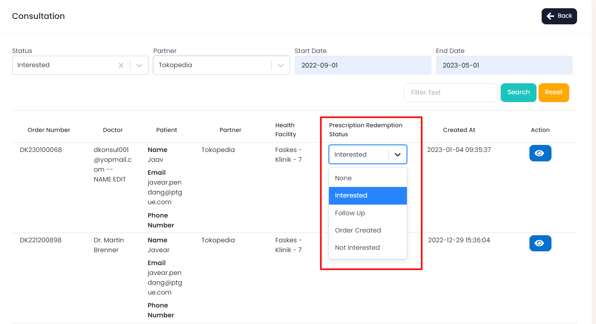

# Faskes DKonsul
## 1. Overview

**Doctor to Doctor (D2D)** adalah aplikasi yang dibuat untuk membantu dokter dalam mengembangkan dirinya. Aplikasi ini memungkinkan para dokter untuk berbagi informasi dan pengalaman dalam menangani kasus pasien, meminta saran atau meminta pendapat tentang diagnosis dan pengobatan, serta berdiskusi tentang topik medis terbaru. Penggunaan aplikasi Doctor to Doctor dapat meningkatkan efisiensi dan efektivitas dalam memberikan pelayanan kesehatan, karena para dokter dapat dengan cepat dan mudah memperoleh informasi yang dibutuhkan dari dokter lainnya, bahkan dari berbagai negara atau wilayah yang berbeda. Selain itu, aplikasi ini juga dapat membantu para dokter untuk tetap terhubung dan terus belajar dari pengalaman dan pengetahuan kolega mereka.

## 2. Product Vision
### 2.1 Visi Misi

Visi D2D adalah : 
D2D Sebagai aplikasi  dokter nomor 1.

Misi D2D adalah :
1. Memberikan platform yang aman, mudah digunakan, dan terpercaya untuk dokter dalam berkomunikasi dan berkonsultasi dengan dokter lainnya.
2. Meningkatkan akses dokter ke sumber daya medis dan informasi terbaru yang diperlukan untuk menangani kasus pasien dengan lebih efektif.
3. Membangun komunitas dokter yang kuat dan solid dalam berkolaborasi dan saling belajar satu sama lain.
4. Menjadi solusi terdepan dalam memberikan layanan konsultasi medis online secara global.

### 2.2 Positioning Framework
#### 2.2.1 Point of View

1. User/Dokter

     Untuk dokter, yang membutuhkan update ilmu kedokteran, D2D adalah aplikasi penunjang profesi dokter yang kredibel dan terpercaya. Berbeda dengan Docquity, Alomedika, Halodoc, D2D merupakan _**unique differentiation statement**_.
     - **D2D** Memiliki akses webinar & sertifikat yang mudah.
     - _End-to-End_ proses di fitur event D2D lebih lengkap dan mudah diakses.

2. Principal

    Untuk principal, yang membutuhkan exposure produk ke dokter, D2D adalah aplikasi penunjang profesi dokter yang kredibel dan terpercaya. Berbeda dengan Docquity, Alomedika, Halodoc, D2D merupakan _**unique differentiation statement**_.
    - _End-to-End_ proses di fitur event D2D lebih lengkap dan mudah diakses.

3. Asosiasi

    Untuk asosiasi kedokteran, yang membutuhkan platform untuk memfasilitasi kegiatan online, D2D adalah aplikasi penunjang profesi dokter yang kredibel dan terpercaya. Berbeda dengan Docquity, Alomedika, Halodoc, D2D merupakan  _**unique differentiation statement**_.

## 3. Platform Aplikasi D2D & Dkonsul
### 3.1. Faskes DKonsul

Aplikasi DKonsul dirancang untuk memudahkan masyarakat dalam mendapatkan layanan konsultasi medis yang cepat dan mudah. Selain itu DKonsul juga dapat membantu mengurangi biaya dan waktu yang diperlukan untuk pergi ke klinik atau rumah sakit, serta memungkinkan dokter untuk memberikan layanan konsultasi medis secara fleksibel dan efektif

#### 3.1.2 Fitur-Fitur Aplikasi
1. Dashboard

    A. Info Partner

    Action ini digunakan untuk mengetahui info partner mana saja yang terhubung dengan faskes DKonsul, untuk memilih partner mana saja bisa mengklik “Partner”, lalu akan muncul dropdown list partner.

    
    Setelah kita mengklik salah satu partner tersebut maka kita akan melihat list para dokter yang terdaftar seperti pada gambar berikut.

    

    B. Specialist

    Kita juga dapat memfilter sesuai dengan spesialist dokter yang dimilikinya, seperti dokter umum, spesialis anak, spesialis andrologi dan spesialis-spesialis lainnya, terlihat pada gambar berikut.

    
    Jika kita mengklik salah satu spesialis, maka akan muncul dokter sesuai dengan filter yang di pilih, seperti pada gambar berikut.

    

    C. Faskes

    Pada filter ini, kita bisa memfilter faskes yang sudah terdaftar di DKonsul, kita juga bisa memilih salah satu dari list berikut, seperti pada gambar dibawah ini.

    

    D. Reset, Search, Filter Action

    Action ini digunakan untuk mencari partner dengan menulis di kolom filter, kemudian klik button search, dan button reset digunakan untuk menghapus sehingga seperti tampilan awal.

    

2. Consultation
    
    A. Status, Partner, Filter, Search, Reset Action, Start Date, dan End Date

    Action ini bertujuan untuk mencari status prescription, kemudian mencari partner, kemudian bisa mencari nama dengan filter, lalu klik tombol “Search”, dan tombol reset untuk merefresh dashboard tersebut.

    

    Kita juga bisa memilih, status apa yang kita ingin filter misal kita memilih filter Interested maka list di dashboard akan terfilter, seperti pada gambar berikut.

    

    Disisi lain, kita juga memfilter status kemudian partner sesuai dengan keinginan kita, misal kita memilih status Interested, kemudian partner kita memilih sesuai dengan kebutuhan lalu atur tanggal, maka akan terlihat seperti pada gambar berikut.

    
    

    B. Prescription Redemption Status

    Action ini digunakan untuk mengubah status order number, sesuai dengan status yang diubah.

    

3. Role

    A. Filter, Search, Reset Action

    Action ini bertujuan untuk mencari role yang diinginkan mencari nama dengan filter, lalu klik tombol “Search”, dan tombol reset untuk merefresh dashboard tersebut.

